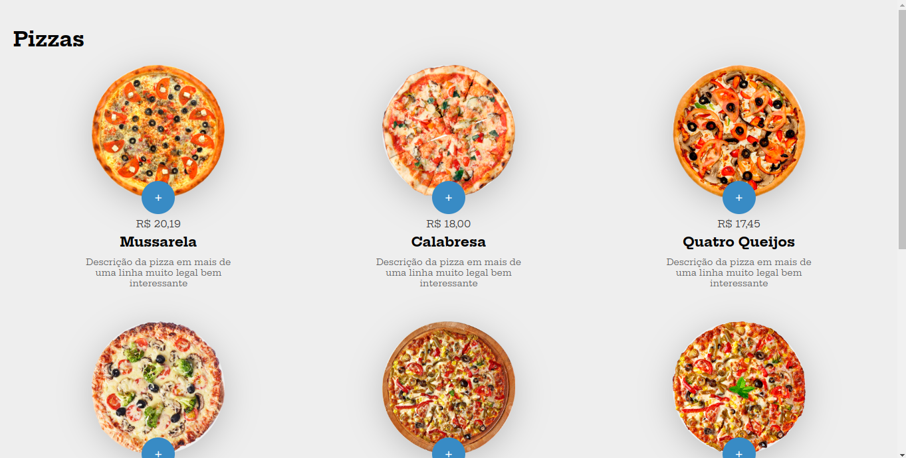

<h1 align="center"> Projeto Compra de Pizzas </h1>

Projeto de compras de pizzas desenvolvido no curso de JavaScript da B7Web.  

  <a href="#-tecnologias">Tecnologias</a>&nbsp;&nbsp;&nbsp;|&nbsp;&nbsp;&nbsp;
  <a href="#-projeto">Projeto</a>

 

  

## 🚀 Tecnologias

Esse projeto foi desenvolvido com as seguintes tecnologias:

  
  
  

## 💻 Projeto

Projeto para criar um carrinho de compras de pizzas para praticar os conceitos de JavaScript!

- [Visite o projeto online](https://micaelsantiago.github.io/projetoPizzaria-B7Web/)

## 🤝 Colaborador(es)

<table>
  <tr>
    <td align="center">
      <a href="http://github.com/micaelsantiago">
         
        
          <b>micaelsantiago</b>
        
      </a>
    </td>
  </tr>
</table>

## :dart: Status do projeto
* Concluído! :ballot_box_with_check:
